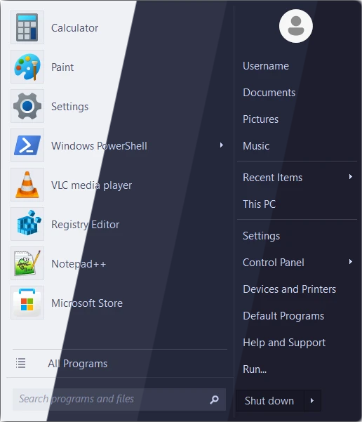
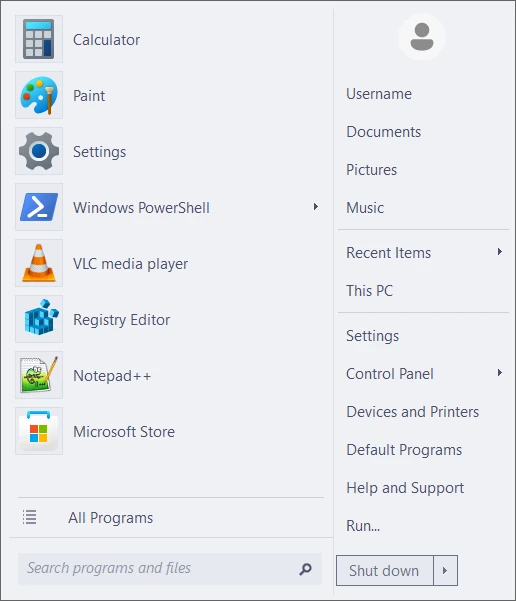
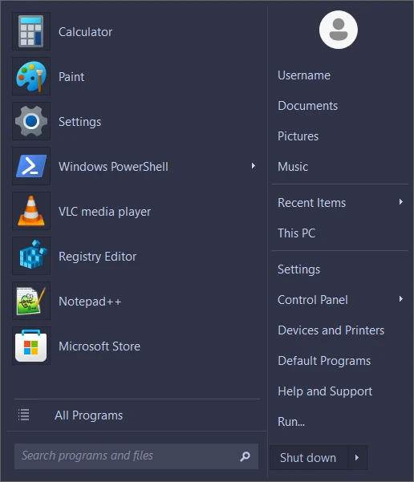
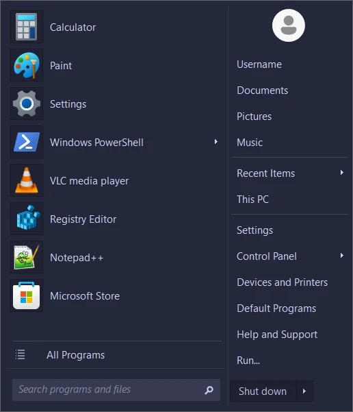
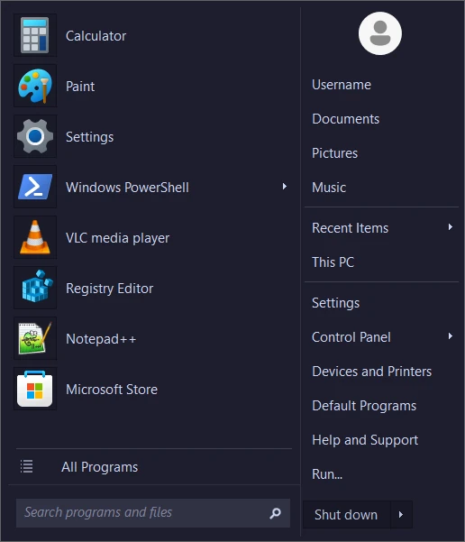
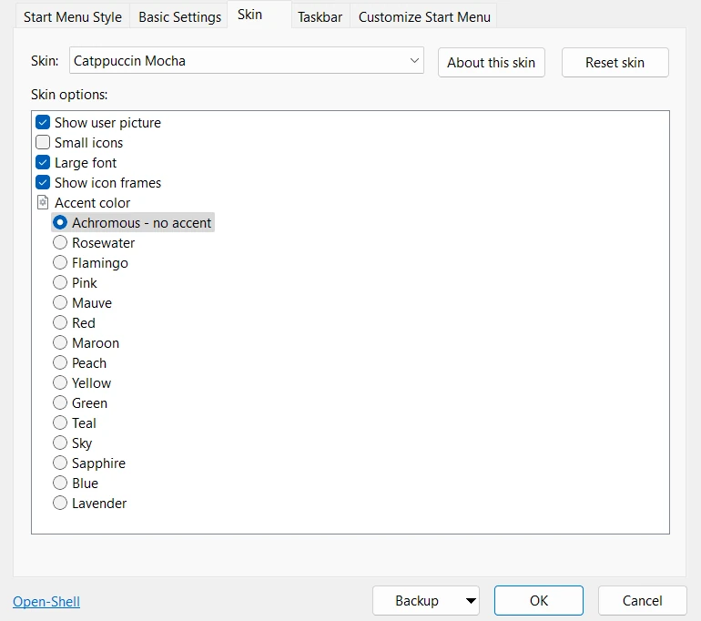

<h3 align="center">
	 
	
	Catppuccin for <a href="https://open-shell.github.io/Open-Shell-Menu/">Open-Shell Menu</a>
	
</h3>

	
	
	

	

## Previews

🌻 Latte

	

🪴 Frappé

	

🌺 Macchiato

	

🌿 Mocha

	

## Usage

1. Download your preferred flavor from [Releases](../../releases).
2. Copy .skin and .skin7 files to: `C:\Program Files\Open-Shell\Skins`.
3. Navigate to the "Skins" tab in Open-Shell settings.
4. Select your preferred flavor from the dropdown.

5. Under "Skin options" set your preferred accent color.
6. Click OK to save the changes.

## 💝 Thanks to

- [ScottyGrotty](https://github.com/ScottyGrotty)

&nbsp;

	

	Copyright &copy; 2021-present <a href="https://github.com/catppuccin" target="_blank">Catppuccin Org</a>

	

